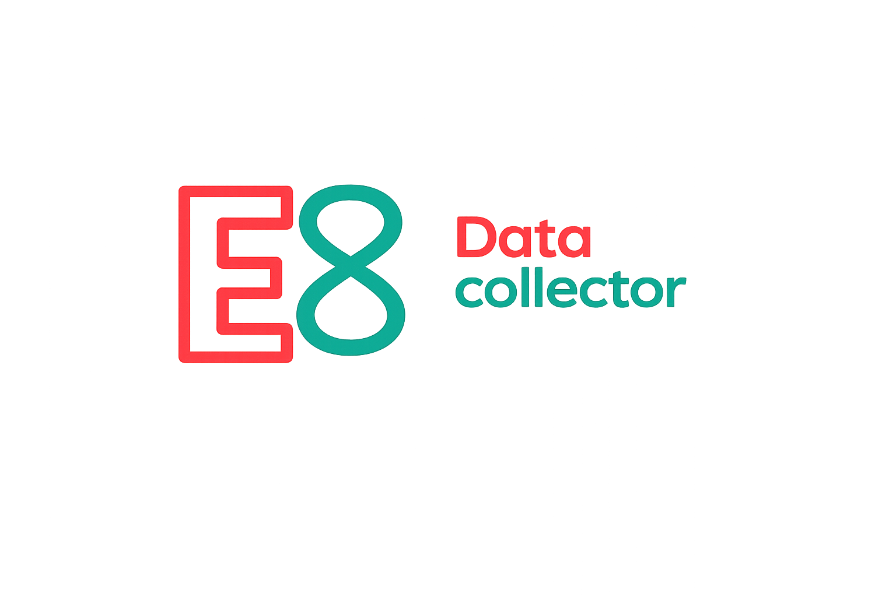

<div align="center">

<a href="https://e8.team/portfolio/data-collector/"></a>

<p><b>A framework for collecting labeled data.</b><br>
Flutter client (on-device, offline-first) + Django backend with a web admin panel and mobile API.</p>

<p>


</p>

<p>
<a href="#quick-start"><b>Quick start</b></a> |
<a href="#how-it-looks">How it looks</a> |
<a href="docs/admin-panel/README.md">Admin guide</a> |
<a href="docs/mobile-app/README.md">Mobile guide</a> |
<a href="#documentation">Docs</a>
</p>

<sub><b>Language / Язык:</b> <b>English</b> | <a href="README.ru.md">Русский</a></sub>

</div>

---

The core is domain-neutral. What and how to collect is defined by the **project config** stored in Git. Concrete scenarios are **projects built on the framework**: ready-made examples live in [examples](examples/).

## How it looks

Three parts of the product in one flow: **configure the project → collect data on device → review packages in the admin panel**.

**1. Project setup.** Web admin: project in Git, visual config editor, collector access.


**2. Field collection.** Flutter: sign-in, config from server, fill the form, upload queue (offline-first).


**3. Packages and review.** List of accepted packages, filters, media and data viewer, edits, pipeline visualization.


---

## Navigator: what lives where

```
data-collector/
├── lib/                # Flutter app (collection client). Entry point: lib/main.dart
├── android/ ios/ web/ macos/ linux/ windows/   # Flutter platform wrappers
├── assets/             # client assets: neutral demo configs, placeholders
├── examples/           # domain example projects on the framework (see examples/README.md)
├── django_server/      # API + web admin (/ui/). Own manage.py, migrations, runserver
├── test_dev/           # Docker Compose: PostgreSQL + MinIO for prod-like local dev
├── specs/              # specifications, diagrams (.drawio), presentation, status
├── docs/               # user guides and engineering notes
└── legacy/             # unused in the main pipeline (see legacy/README.md)
```

Subsystem details: [django_server/README.md](django_server/README.md),
[test_dev/README.md](test_dev/README.md), [legacy/README.md](legacy/README.md).

---

## Guides and materials

The fastest way to understand the product: start here.

| Material | Contents |
| -------- | -------- |
| **[Product presentation](specs/presentation/Data-Collector.pptx)** | Product overview, scenarios, screenshots. |
| **[Guide: admin panel](docs/admin-panel/README.md)** | Project creation, visual config editor, access control, package viewer and pipeline **visualization**. |
| **[Guide: mobile app](docs/mobile-app/README.md)** | Operator flow on the cattle (KRS) project example: sign-in → project → form → package upload. |
| **[Example projects](examples/README.md)** | Ready-made domain configs on the framework. |

---

## Quick start

```bash
# 1. Backend (local mode, SQLite)
cd django_server
pip install -r requirements.txt
python manage.py migrate
python manage.py createsuperuser
python manage.py runserver 0.0.0.0:8000
# admin panel: http://127.0.0.1:8000/ui/login/

# 2. Client (Android emulator; 10.0.2.2 = host PC)
flutter pub get
flutter run --dart-define=API_BASE_URL=http://10.0.2.2:8000
```

> **Important (offline-first):** after filling the form, the package is saved **locally on the device**.
> It reaches the server only after a manual step: **«Upload queue» → «Send»** screen.

For launch details, configuration, Firebase, and production, see [django_server/README.md](django_server/README.md),
[test_dev/README.md](test_dev/README.md), [docs/deploy-flutter-web.md](docs/deploy-flutter-web.md)
and the specs below.

---

## Documentation

### Overview and architecture

| File | About |
| ---- | ----- |
| [specs/01-overview.md](specs/01-overview.md) | Product overview and current scope |
| [specs/03-user-journey-screens.md](specs/03-user-journey-screens.md) | Flutter screens and `/ui/` |
| [specs/04-tech-stack-architecture.md](specs/04-tech-stack-architecture.md) | Stack and repository structure |
| [specs/06-upload-lifecycle.md](specs/06-upload-lifecycle.md) | Upload lifecycle on device |
| [specs/07-package-payload-structure.md](specs/07-package-payload-structure.md) | Package structure and camera metadata |

### Project config and JSON building

| File | About |
| ---- | ----- |
| [specs/config/09-project-json-builder-guide.md](specs/config/09-project-json-builder-guide.md) | **Canonical**: project JSON config builder guide |
| [specs/config/json-driven-collection-ui.md](specs/config/json-driven-collection-ui.md) | JSON-driven collection UI (flow screens) |
| [specs/config/json-ui-flow.drawio](specs/config/json-ui-flow.drawio) | Config flow diagram |
| [specs/git-backed-projects.md](specs/git-backed-projects.md) | Git project repository: deploy key, config sync |
| [specs/09-server-project-config-delivery.md](specs/09-server-project-config-delivery.md) | Config creation and delivery to client |

### Server, API, storage

| File | About |
| ---- | ----- |
| [specs/08-server-api-package-upload.md](specs/08-server-api-package-upload.md) | API and server package upload flow |
| [specs/project-storage-uris.md](specs/project-storage-uris.md) | `database_uri`, `storage_uri`: Postgres / S3 / GCS |
| [specs/collector-vis-config.md](specs/collector-vis-config.md) | Pipeline visualization config in admin |
| [django_server/README.md](django_server/README.md) | Roles, launch, package storage |

### Diagrams (`specs/main-scheme/`, `.drawio`)

| File | About |
| ---- | ----- |
| [specs/main-scheme/01-abstract-config-entities.drawio](specs/main-scheme/01-abstract-config-entities.drawio) | Abstract config: entities → projects |
| [specs/main-scheme/02-client-server-config-and-package.drawio](specs/main-scheme/02-client-server-config-and-package.drawio) | Config ↔ client ↔ package |
| [specs/main-scheme/03_server_api.drawio](specs/main-scheme/03_server_api.drawio) | Package upload (API and flow) |
| [specs/main-scheme/04-auth-firebase-django.drawio](specs/main-scheme/04-auth-firebase-django.drawio) | Authentication: Firebase ↔ Django |
| [specs/main-scheme/05-admin-roles-access.drawio](specs/main-scheme/05-admin-roles-access.drawio) | Admin roles: staff / client-admin / employee |
| [specs/main-scheme/](specs/main-scheme/) | Other diagrams (06–11), `todo.txt` for review |

### Status and backlog

- Status/exports: [specs/status/](specs/status/).
- Business materials (training plan): [docs/business/](docs/business/).
- Current tasks: [specs/todo](specs/todo).
