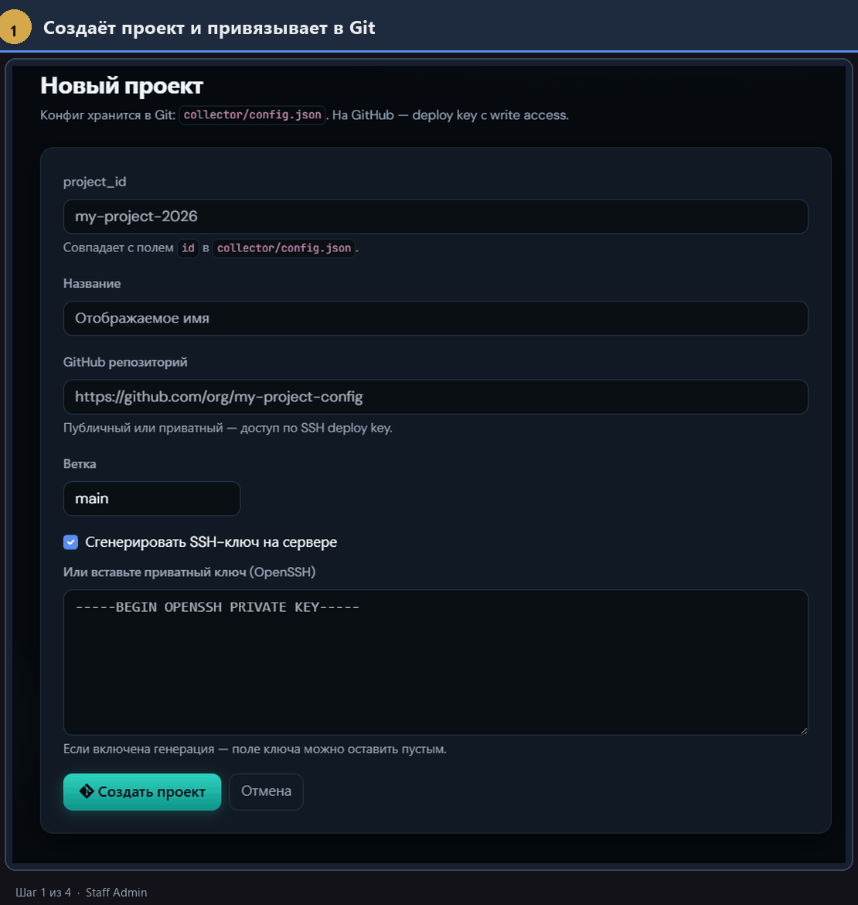
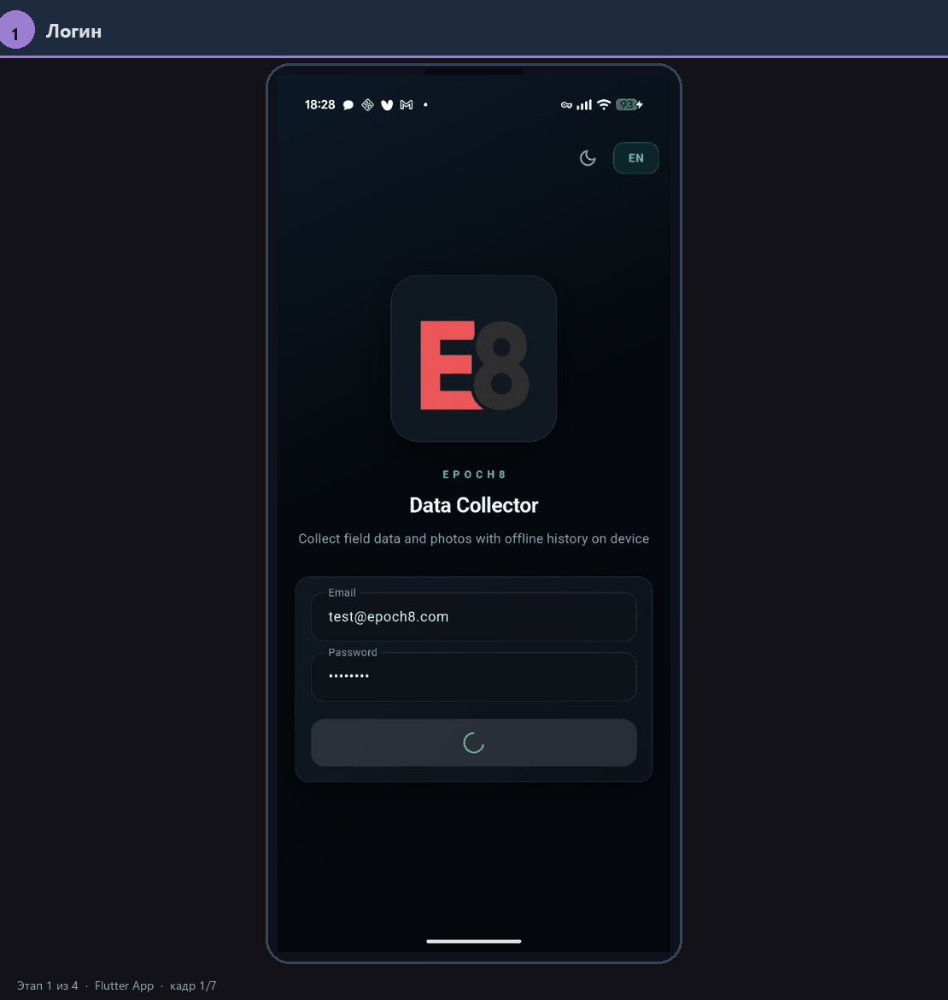
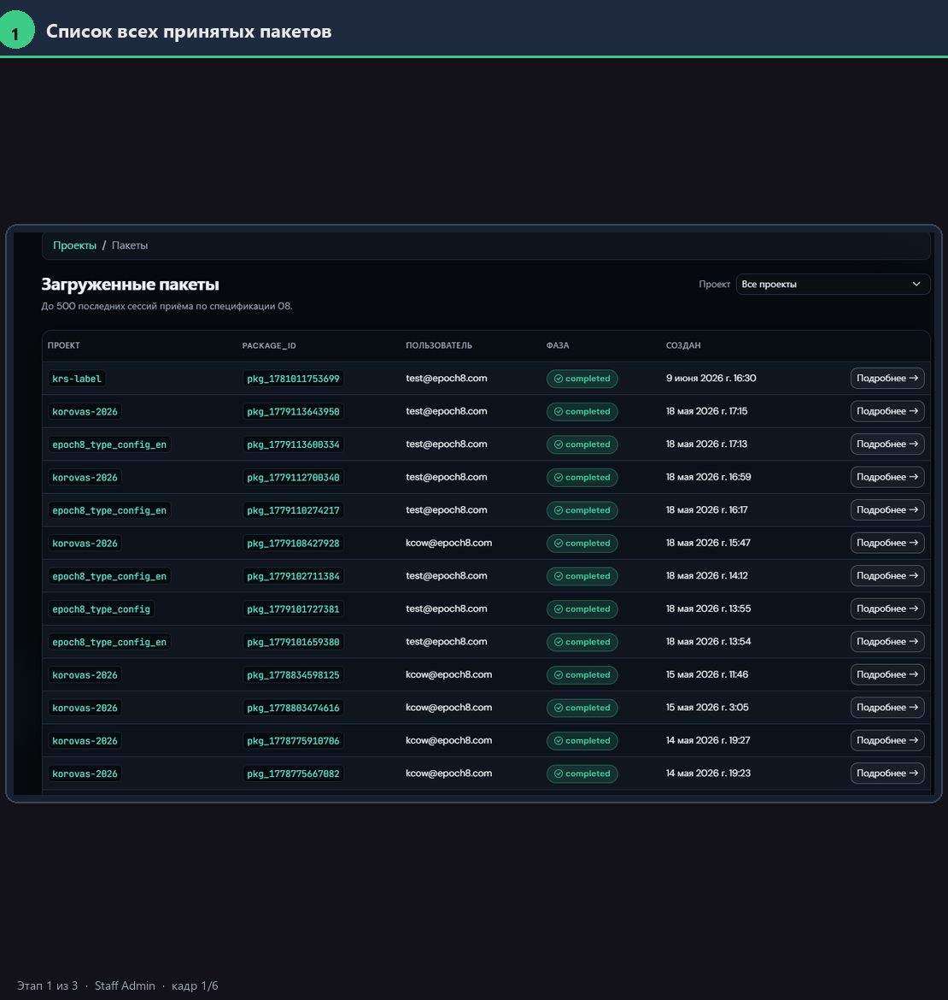

> **Language / Язык:** [English](README.md) · **Русский**

# Data collector

**Фреймворк** для сбора размеченных данных: **Flutter-клиент** (сбор на устройстве, offline-first) и **Django-бэкенд** с веб-админкой (`/ui/`) и мобильным API (`/v1/*`).

Ядро нейтрально к предметной области. Что и как собирать задаётся **конфигом проекта**
(`collector/config.json` в Git). Конкретные сценарии — это **проекты на базе фреймворка**:
готовые примеры лежат в [`examples/`](examples/), нейтральные демо для бандла — в `assets/config/`.

## Как это выглядит

Три части продукта в одном потоке: **настроить проект → собрать данные на устройстве → проверить пакеты в админке**.

**1. Настройка проекта** — веб-админка: проект в Git, визуальный редактор `config.json`, доступы сборщикам.



**2. Сбор в поле** — Flutter: вход, конфиг с сервера, заполнение формы, очередь отправки на сервер (offline-first).



**3. Пакеты и проверка** — список принятых пакетов, фильтры, просмотр медиа и данных, правки, визуализация pipeline.



Пример развёрнутого инстанса (проект «korovas»): `https://data-collector-app.korovas.ml.epoch8.dev`
(админка `/ui/`, API с того же хоста; в `API_BASE_URL` не добавляйте завершающий `/`).
Домен и имена docker-образов в `Makefile` — значения этого конкретного деплоя, а не часть фреймворка.

---

## Навигатор: что где лежит

```
data-collector/
├── lib/                # Flutter-приложение (клиент сбора). Точка входа: lib/main.dart
├── android/ ios/ web/ macos/ linux/ windows/   # платформенные обёртки Flutter
├── assets/             # ассеты клиента: нейтральные демо-конфиги (assets/config/), плейсхолдеры (assets/placeholders/)
├── examples/           # доменные проекты-примеры на базе фреймворка (см. examples/README.ru.md)
├── django_server/      # API + веб-админка (/ui/). Свой manage.py, миграции, runserver
├── test_dev/           # Docker Compose: PostgreSQL + MinIO для прод-подобной локалки
├── specs/              # спецификации, схемы (.drawio), презентация, статус
├── docs/               # руководства пользователя и инженерные заметки
└── legacy/             # неиспользуемое в основном пайплайне (см. legacy/README.ru.md)
```

Подробности по подсистемам: [`django_server/README.ru.md`](django_server/README.ru.md),
[`test_dev/README.ru.md`](test_dev/README.ru.md), [`legacy/README.ru.md`](legacy/README.ru.md).

---

## Гайды и материалы

Самый быстрый способ понять продукт — начните отсюда:


| Материал | Что внутри |
| -------- | ---------- |
| **[Презентация продукта](specs/presentation/Data-Collector.pptx)** (`specs/presentation/Data-Collector.pptx`) | Обзор продукта, сценарии, скриншоты. Исходники кадров — в `specs/presentation/img/`. |
| **[Руководство: админ-панель](docs/admin-panel/README.ru.md)** | Создание проектов, визуальный редактор конфига, доступы, просмотр пакетов и **визуализация** результатов pipeline. |
| **[Руководство: мобильное приложение](docs/mobile-app/README.ru.md)** | Путь оператора на примере проекта КРС: вход → проект → форма → отправка пакета. |
| **[Примеры проектов](examples/README.ru.md)** | Готовые доменные конфиги на базе фреймворка (напр. `examples/cow-keypoints/`). |


---

## Быстрый старт

```bash
# 1. Бэкенд (local-режим, SQLite)
cd django_server
pip install -r requirements.txt
python manage.py migrate
python manage.py createsuperuser
python manage.py runserver 0.0.0.0:8000
# админка: http://127.0.0.1:8000/ui/login/

# 2. Клиент (Android-эмулятор; 10.0.2.2 — хост-ПК)
flutter pub get
flutter run --dart-define=API_BASE_URL=http://10.0.2.2:8000
```

> **Важно (offline-first):** после заполнения формы пакет сохраняется **локально на устройстве**.
> На сервер он попадает только после ручного шага: экран **«Очередь на сервер» → «Отправить»**.

Детали запуска, конфигурации, Firebase и продакшена — в [`django_server/README.ru.md`](django_server/README.ru.md),
[`test_dev/README.ru.md`](test_dev/README.ru.md), [`docs/deploy-flutter-web.ru.md`](docs/deploy-flutter-web.ru.md)
и в спеках ниже.

---

## Документация

### Обзор и архитектура


| Файл | О чём |
| ---- | ----- |
| [`specs/01-overview.ru.md`](specs/01-overview.ru.md) | Обзор продукта и текущий scope |
| [`specs/03-user-journey-screens.ru.md`](specs/03-user-journey-screens.ru.md) | Экраны Flutter и `/ui/` |
| [`specs/04-tech-stack-architecture.ru.md`](specs/04-tech-stack-architecture.ru.md) | Стек и структура репозитория |
| [`specs/06-upload-lifecycle.ru.md`](specs/06-upload-lifecycle.ru.md) | Жизненный цикл upload на устройстве |
| [`specs/07-package-payload-structure.ru.md`](specs/07-package-payload-structure.ru.md) | Структура пакета и camera metadata |


### Конфиг проекта и сборка JSON


| Файл | О чём |
| ---- | ----- |
| [`specs/config/09-project-json-builder-guide.ru.md`](specs/config/09-project-json-builder-guide.ru.md) | **Канон**: гайд по сборке JSON-конфига проекта |
| [`specs/config/json-driven-collection-ui.ru.md`](specs/config/json-driven-collection-ui.ru.md) | JSON-driven UI сбора (экраны flow) |
| [`specs/config/json-ui-flow.drawio`](specs/config/json-ui-flow.drawio) | Схема flow конфига |
| [`specs/git-backed-projects.ru.md`](specs/git-backed-projects.ru.md) | Git-репозиторий проекта: deploy key, `config.json`, синхронизация |
| [`specs/09-server-project-config-delivery.ru.md`](specs/09-server-project-config-delivery.ru.md) | Создание и доставка конфига клиенту |


### Сервер, API, хранилища


| Файл | О чём |
| ---- | ----- |
| [`specs/08-server-api-package-upload.ru.md`](specs/08-server-api-package-upload.ru.md) | API и поток загрузки пакета на сервер |
| [`specs/project-storage-uris.ru.md`](specs/project-storage-uris.ru.md) | `database_uri`, `storage_uri`: Postgres / S3 / GCS |
| [`specs/collector-vis-config.ru.md`](specs/collector-vis-config.ru.md) | `collector/viz.json` — визуализация pipeline в админке |
| [`django_server/README.ru.md`](django_server/README.ru.md) | Роли, запуск, хранение пакетов |


### Схемы (`specs/main-scheme/`, `.drawio`)


| Файл | О чём |
| ---- | ----- |
| [`specs/main-scheme/01-abstract-config-entities.drawio`](specs/main-scheme/01-abstract-config-entities.drawio) | Абстрактный конфиг: сущности → проекты |
| [`specs/main-scheme/02-client-server-config-and-package.drawio`](specs/main-scheme/02-client-server-config-and-package.drawio) | Конфиг ↔ клиент ↔ пакет |
| [`specs/main-scheme/03_server_api.drawio`](specs/main-scheme/03_server_api.drawio) | Загрузка пакета (API и поток) |
| [`specs/main-scheme/04-auth-firebase-django.drawio`](specs/main-scheme/04-auth-firebase-django.drawio) | Аутентификация: Firebase ↔ Django |
| [`specs/main-scheme/05-admin-roles-access.drawio`](specs/main-scheme/05-admin-roles-access.drawio) | Роли админки: staff / client-admin / сотрудник |
| [`specs/main-scheme/`](specs/main-scheme/) | Прочие схемы (06–11), `todo.txt` для ревизии |


### Статус и backlog

- Статус/выгрузки: [`specs/status/`](specs/status/).
- Коммерческие материалы (план обучения): [`docs/business/`](docs/business/).
- Текущие задачи: [`specs/todo`](specs/todo).
- Внешний разбор репозитория: [`docs/todo-renat.md`](docs/todo-renat.md).
