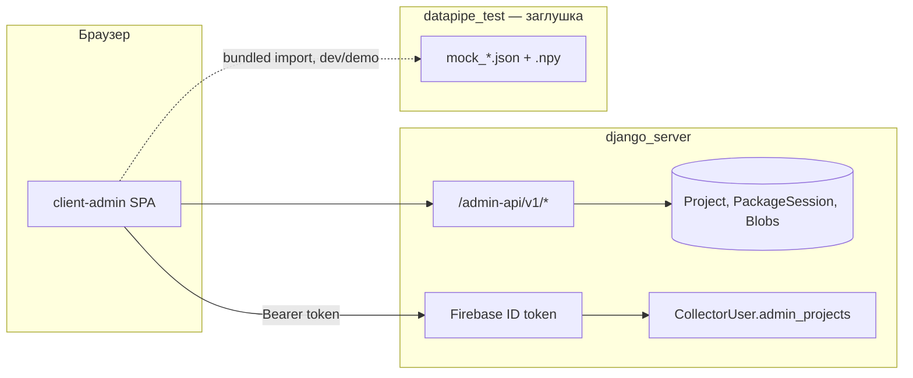

# client-admin

Веб-UI для просмотра и правки **принятых пакетов** (manifest, blobs). Статический SPA; бэкенд — только `django_server`.

## Связь с django_server



| Аспект | django_server | client-admin | datapipe_test |
|--------|---------------|--------------|---------------|
| Авторизация | Проверка Firebase token, `CollectorUser` | `Authorization: Bearer` | — |
| Список проектов / пакетов | `/admin-api/v1/projects`, `…/packages` | `api/client.ts` | `VITE_USE_MOCK` → `mock-data.ts` |
| Конфиг полей, manifest, blobs | workspace + PATCH manifest | Вкладки **Данные**, **Медиа** | — |
| Превью файлов | `…/blobs/{id}/preview` | `AuthenticatedImage` | — |
| GT / inference / depth | *пока нет в API* | Вкладка **Визуализация** | **заглушка** (JSON + npy) |
| История правок полей | *пока нет* | вкладка в dev | `field_changelog.json` + Vite `/local-api` |

Права: в Django отдельно **`admin_projects`** (client-admin) и **`mobile_projects`** (приложение). Настройка: `/ui/users/` или Admin → Пользователи (Firebase).

## Сборка и деплой

```bash
cd client-admin
npm ci
npm run build    # артефакт: dist/
```

Прокси `/admin-api` есть только в `npm run dev`. В проде nginx (или аналог) отдаёт `dist/` и проксирует `/admin-api` → Django.

| Переменная | Назначение |
|------------|------------|
| `VITE_FIREBASE_*` | Web SDK (см. `.env.example`) |
| `VITE_USE_MOCK=true` | UI без Django |
| `VITE_FIREBASE_AUTH_ENABLED=false` | Dev без Firebase (Django тоже без Firebase) |

## Локальная разработка

```bash
# терминал 1
cd django_server && python manage.py runserver

# терминал 2
cd client-admin && npm run dev   # http://localhost:5173
```

Демо визуализации: пакет `korovas-2026` / `pkg_1779969797246` в БД + файлы в [`../datapipe_test/README.md`](../datapipe_test/README.md).

Подробный контракт API: [docs/05-api-contract.md](docs/05-api-contract.md).
