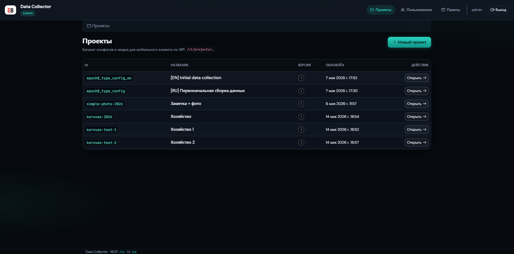
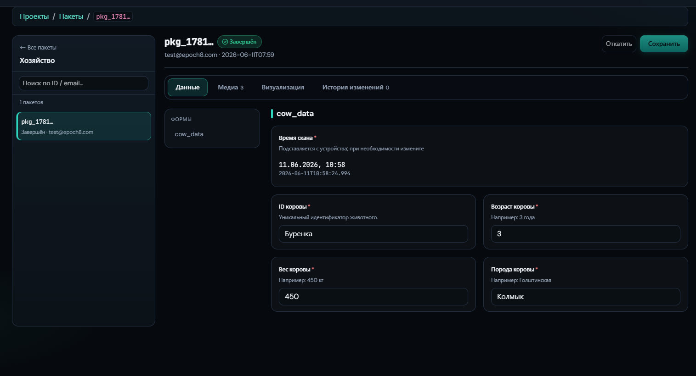
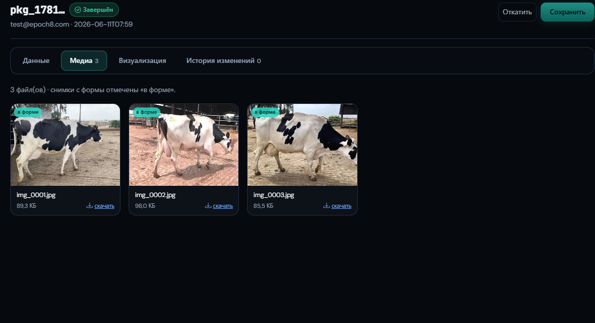
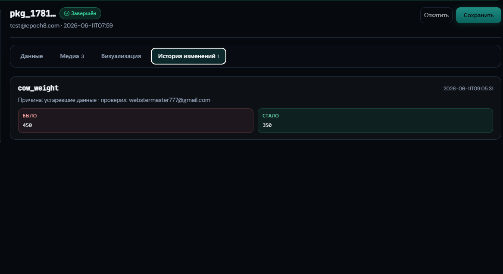
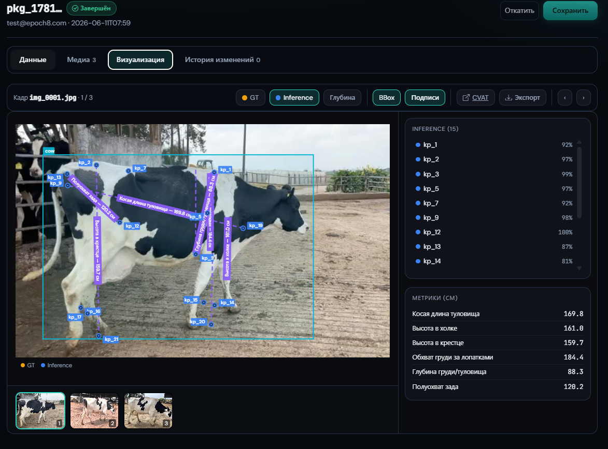

> **Language / Язык:** [English](README.md) · **Русский**

# Руководство пользователя: административная панель

Инструкция по настройке проектов, доступа пользователей и просмотру загруженных пакетов (с визуализацией результатов pipeline).

Скриншоты — из презентации продукта [`specs/presentation/Data-Collector.pptx`](../../specs/presentation/Data-Collector.pptx) (исходники кадров — в `specs/presentation/img/`). Интерфейс развивается, поэтому отдельные кадры могут отличаться от текущей версии — ориентируйтесь на текст.

**Адрес панели:** веб-админка вашего инстанса по пути `/ui/`.

---

## **1. Вход в панель**

1. Откройте веб-админку вашего инстанса по адресу `…/ui/login/`.
2. Войдите учётной записью администратора (Django **staff**) — выдаёт администратор инстанса.
3. После входа откроется список проектов.

---

## **2. Краткий обзор интерфейса**

В верхнем меню три раздела:

| **Раздел** | **Назначение** |
| --- | --- |
| **Проекты** | Создание и настройка сценариев сбора данных, медиа для инструкций |
| **Пользователи** | Учётки Firebase и доступ к проектам в мобильном приложении |
| **Пакеты** | Просмотр данных, загруженных с телефонов |

---

## **3. Проекты**

### **3.1. Список проектов**

Раздел **Проекты** — каталог всех проектов (инициатив сбора). Для каждого видны `project_id`, название, версия конфига и дата обновления.

Под каждую площадку/инициативу заводится **отдельный проект** (например, `my-project-2026`). Структура конфига может быть одинаковой, а названия и `project_id` — разными.

### **3.2. Создание нового проекта**

> **Важно:** конфиг проекта хранится **не в БД, а в Git-репозитории** (`collector/config.json`). Поэтому при создании проекта нужно указать репозиторий и настроить доступ по SSH deploy key. Хранилище данных (БД/медиа) — **опционально**.

Нажмите **«Новый проект»** и заполните форму:

1. **project_id** — латиница, совпадает с полем `id` в `collector/config.json` (например, `my-project-2026`).
2. **Название** — как проект отображается в приложении.
3. **Git-репозиторий** — URL репозитория с конфигом (публичный или приватный; доступ по SSH deploy key).
4. **Ветка** — по умолчанию `main`.
5. **SSH-ключ** — оставьте включённым **«Сгенерировать SSH-ключ на сервере»** (рекомендуется) или вставьте собственный приватный ключ (формат OpenSSH).
6. **Хранилище данных** (необязательный блок) — см. 3.4. Если оставить пустым: SQLite + локальная папка на сервере.

Нажмите **«Создать проект»**.

После создания нужно **разрешить серверу доступ к репозиторию**: скопировать публичный deploy key (см. 3.3) и добавить его в настройках репозитория с правом **записи** (write access). Затем сервер сможет читать конфиг и сохранять правки.

### **3.3. Git: deploy key и синхронизация конфига**

Конфиг (`collector/config.json`), визуализация (`collector/viz.json`) и медиа для инструкций (`collector/media/`) живут в Git-репозитории проекта.

- На карточке проекта откройте **«SSH-ключ»** — там показан **публичный deploy key**. Добавьте его в репозиторий (Deploy keys) с правом **write access**. При необходимости можно вставить и собственный приватный ключ.
- Кнопка **«Проверить Git»** на карточке делает синхронизацию (pull) и при первом запуске может создать стартовый `config.json`.
- Сохранение в редакторе/JSON = commit + push в репозиторий.

Принцип: **1 репозиторий = 1 проект**.

### **3.4. Хранилище данных (БД и медиа) — опционально**

Где хранятся **пакеты и медиа** конкретного проекта, настраивается отдельно (карточка проекта → раздел «Хранилище»). Если поля пустые — **SQLite + локальная папка** на сервере (подходит для старта).

Поля:

- **Медиа (blobs)** — `storage_uri`: например `s3://bucket/my-project/` или `gs://bucket/`. Пусто — локальная папка.
- **S3 / MinIO** — endpoint, ключ и секрет (нужны только для `s3://`).
- **PostgreSQL — адрес** — `database_uri` без логина/пароля (например `postgresql+psycopg2://host:5432/proj_my_project`). **База создаётся автоматически** при сохранении.
- **PostgreSQL — логин и пароль** — отдельными полями.

После изменения адреса нажмите **«Проверить хранилище»**. Смена адреса **не переносит** уже сохранённые данные.

### **3.5. Карточка проекта**

Откройте проект из списка. На карточке:

**Основная информация:**

- версия конфига;
- список файлов на диске — медиа для инструкций (например, эталонные кадры/ракурсы);
- число сессий загрузки пакетов — можно открыть загруженные пакеты этого проекта.

**Кнопки:**

- **Редактор** — визуальный редактор конфига;
- **JSON** — конфигурация проекта в виде JSON;
- **Файлы** — загрузка файлов для инструкций;
- **Пакеты** — просмотр загруженных пакетов проекта;
- **SSH-ключ**, **Хранилище**, **Проверить Git/хранилище** — настройка Git и хранилища (см. 3.3–3.4).

### **3.6. Визуальный редактор (настройка сценария сбора)**

Конфиг определяет, **что** собирает мобильное приложение: поля, экраны, порядок шагов.

Для редактирования конфига перейдите в визуальный редактор (кнопка «Редактор»):

Основные элементы:

1. **Поля** — задаются поля для приложения (текст, дата, инструкции (md), фото и т. д.).
    
    
    
2. **Сценарий (flow)** — порядок и расположение полей по экранам: `scroll_form` (форма со скроллом) и `review` (проверка перед отправкой).
    
    
    
3. **Режим JSON** — правка всего файла конфига вручную для опытных администраторов.
    
    
    

### **3.7. Файлы проекта (медиа)**

Раздел **«Файлы»** на карточке проекта:

- загрузка картинок и других файлов для инструкций в конфиге;
- файлы отдаются клиенту как `/v1/projects/<project_id>/assets/…`;
- в JSON в Markdown указывайте пути вида `assets/uploads/…`.

### **3.8. Удаление проекта**

Внизу карточки — **«Опасная зона»**. Для подтверждения введите точный `project_id`. Удаляется только запись в каталоге и локальный git-кэш; файлы пакетов и база данных проекта сохраняются.

---

## **4. Пользователи (доступ к мобильному приложению)**

Пользователи авторизуются в приложении через **Firebase** (email/пароль). В панели хранится связка Firebase UID ↔ доступные проекты.

### **4.1. Появление пользователей в списке**

- Нажмите **«Синхронизировать с Firebase»** — подтянуть учётки из Firebase Authentication;
- **или** дождитесь первого входа пользователя в приложение (запись может создаться автоматически).

### **4.2. Назначение проектов**

1. Откройте пользователя → **«Настроить»**.
2. Отметьте чекбоксами проекты, которые он видит в приложении и в которые может загружать пакеты.
3. Нажмите **«Сохранить»**.

---

## **5. Пакеты (данные с полей)**

Раздел **Пакеты** — всё, что операторы отправили с телефонов.

### **5.1. Список**

- До **500** последних сессий.
- Фильтр по проекту в выпадающем списке.
- Колонки: проект, `package_id`, email/UID загрузившего, **фаза**, дата.

### **5.2. Фазы приёма**

| **Фаза** | **Смысл** |
| --- | --- |
| **awaiting_blobs** | Ожидаются файлы (фото и т.д.) |
| **ready_to_commit** | Файлы приняты, ожидается финализация |
| **completed** | Пакет успешно принят |
| **failed** | Ошибка при приёме |

### **5.3. Карточка пакета (workspace)**

Рабочая область пакета состоит из вкладок. Сверху — переключатель пакетов проекта и кнопки **«Откатить» / «Сохранить»** (правки манифеста пишутся в историю изменений).

| Вкладка | Что показывает |
| --- | --- |
| **Данные** | Значения полей формы (по `config.fields`), сгруппированные по шагам. Поля можно править прямо здесь. |
| **Медиа** | Все блобы пакета (фото) с превью и кнопкой **«Скачать»**; снимки «в форме» помечены бейджем. |
| **Визуализация** | Оверлеи pipeline поверх кадров (см. 5.4). |
| **История изменений** | Кто, когда и что менял в манифесте (было → стало, причина). |

**Вкладка «Данные»**

**Вкладка «Медиа»**

**Вкладка «История изменений»**

**Подробнее** открывает также список **блобов** (файлы) с кнопкой **«Скачать»** и **манифест** (JSON после завершения загрузки).

Список пакетов конкретного проекта доступен и с карточки проекта (**«Пакеты»**).

### **5.4. Визуализация (просмотр результатов pipeline)**

Вкладка **«Визуализация»** рисует данные пайплайна (ключевые точки, bbox, глубина, разметка) **поверх кадров** пакета. Конфиг визуализации хранится в Git-репозитории проекта — файл `collector/viz.json` (слои → таблицы в project-БД + плагин рендеринга). Подробно — [`specs/collector-vis-config.ru.md`](../../specs/collector-vis-config.ru.md).

Что на экране:

- **Слои-переключатели** сверху: например **GT** (эталон) и **Inference** (предсказание модели), **Глубина**, **BBox** (рамка объекта), **Подписи** (названия точек/замеров).
- **CVAT** — ссылка на разметку кадра в CVAT; **Экспорт** — выгрузка визуализации.
- **Список точек** справа (`kp_1`, `kp_2`, …) с уверенностью модели (%).
- **Метрики (см)** — производные замеры для объекта (в примере с КРС: косая длина туловища, высота в холке/крестце, обхват груди за лопатками и т. п.).
- Снизу — лента кадров пакета для переключения между фото.

Набор слоёв и плагинов задаётся проектом. Доступные плагины рендеринга: ключевые точки, bbox/детекция (YOLO), карта глубины, ссылка на CVAT. Чтобы визуализация появилась, в репозитории проекта должен быть `collector/viz.json`, а в project-БД — таблицы с данными пайплайна.

---

## **6. Типовой сценарий администратора**

1. **Создать проект**: указать `project_id`, название, **Git-репозиторий** и сгенерировать SSH-ключ.
2. **Дать серверу доступ к репозиторию**: добавить публичный deploy key с правом write, нажать **«Проверить Git»**.
3. (Опц.) **Настроить хранилище** (БД/медиа) и нажать **«Проверить хранилище»**; иначе — SQLite + локальная папка.
4. В **редакторе** настроить поля и сценарий сбора; при необходимости загрузить картинки в **«Файлы»**.
5. **Сохранить** конфиг (commit/push) и проверить версию на карточке проекта.
6. В **Пользователи** синхронизировать Firebase и выдать сотрудникам доступ к проекту.
7. После работы в поле — в **Пакеты** проверить статус, посмотреть данные/визуализацию, скачать файлы/манифест.

---

## **7. Связь с мобильным приложением**

| **Действие в админке** | **Эффект в приложении** |
| --- | --- |
| Создан/изменён проект и конфиг | Проект и форма сбора появляются после синхронизации |
| Назначены проекты пользователю | Проект виден во вкладке **Project** |
| Загружены файлы в «Файлы» | Картинки в инструкциях подтягиваются по API |
| Пакет принят на сервер | Виден в админке; на телефоне — в истории/статусе загрузки |

Подробнее про работу оператора — [руководство по мобильному приложению](../mobile-app/README.ru.md).

---
