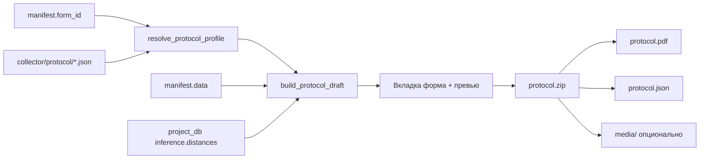

# Сборка протокола бонитировки

Вкладка **«Сборка протокола»** в workspace пакета (`/ui/packages/…`): правка значений, живое превью и выгрузка ZIP (`protocol.pdf` + `protocol.json`, опционально `media/`).

Состав полей задаётся **профилями в Git проекта** (`collector/protocol/*.json`), а не только полями мобильной формы — поэтому у `*_inference` форм тоже видны промеры, баллы и описания.

---

## 1. Где это в продукте

| Место | Что |
| --- | --- |
| Админка → **Пакеты** → карточка пакета | Вкладка после **Визуализация** |
| URL экспорта | `POST …/ui/projects/{project_id}/packages/{package_id}/protocol.zip` |
| Git проекта | `collector/protocol/{profile_id}.json` |
| Код | `protocol_profiles.py`, `protocol_service.py`, `views_ui.py`, `packages_protocol.js` |

---

## 2. Вкладки workspace

| Вкладка | Назначение |
| --- | --- |
| **Данные** | Поля мобильной формы / манифеста |
| **Медиа** | Блобы пакета |
| **Визуализация** | Оверлеи pipeline |
| **Сборка протокола** | Черновик протокола → PDF/ZIP |
| **История изменений** | Правки манифеста |

Подробнее про остальные вкладки — [README.ru.md](README.ru.md) §5.3–5.4.

---

## 3. Профиль протокола (Git)

### 3.1. Путь и имя файла

| Правило | Значение |
| --- | --- |
| Каталог | `collector/protocol/` |
| Файл | `{profile_id}.json` |
| `profile_id` | только `[a-z0-9_]+` (например `cow`, `bull`, `young`) |
| Привязка к форме | список `form_ids` **внутри** профиля (в `config` формы ключа `protocol_profile` нет) |

После правок в репозитории проекта: **Check Git** / sync, иначе кэш `project_git_cache` устареет.

### 3.2. Корень JSON

| Поле | Тип | Описание |
| --- | --- | --- |
| `id` | string | Идентификатор профиля (обычно = имя файла) |
| `title` | string | Человекочитаемое имя («Корова», «Бык-производитель») |
| `version` | string | Версия схемы профиля |
| `form_ids` | string[] | Формы, для которых применяется профиль |
| `identity` | string[] | Порядок полей идентификации |
| `measurements` | string[] | Порядок промеров |
| `qualitative` | string[] | Баллы и описания (`*_desc`) |
| `fields` | object[] | Каталог дескрипторов (title / type / options) |

### 3.3. Элемент `fields[]`

| Поле | Тип | Описание |
| --- | --- | --- |
| `field_id` | string | Ключ в `manifest.data` и в списках секций |
| `type` | string | `text_input` / `single_choice` / `datetime` / … |
| `title` | string | Подпись в UI и PDF |
| `options` | object[] | Для `single_choice`: `{ "value", "label" }` |
| `instructions` | string | Опционально |

### 3.4. Откуда берётся дескриптор поля

| Приоритет | Источник |
| --- | --- |
| 1 | Поле из `collector/config.json` формы (`config.fields`) |
| 2 | Запись из `profile.fields` (каталог протокола) |
| 3 | Fallback: `field_id` как подпись, тип `text_input` |

Так поля, которых нет в урезанной `*_inference` форме (описания, часть оценок), всё равно попадают в протокол.

---

## 4. Привязка форм (Korovas / krs-label)

| Профиль | Файл | `form_ids` |
| --- | --- | --- |
| Корова | `cow.json` | `cow`, `cow_inference` |
| Бык | `bull.json` | `bull`, `bull_inference` |
| Молодняк | `young.json` | `young`, `young_inference` |

Разрешение: `manifest.form_id` ∈ `profile.form_ids` → этот профиль. Если профиль не найден — fallback: эвристика по шагам `flow` формы.

---

## 5. Секции черновика

| Секция UI | Ключ профиля | Содержимое |
| --- | --- | --- |
| **Идентификация** | `identity` | Время сбора, кличка, порода, идентификатор, возраст… |
| **Промеры** | `measurements` | Таблица: итог / ручной / инференс |
| **Качественные признаки** | `qualitative` | Балл + текстовое описание (`*_desc`) |
| **Прочее** | (только fallback) | Поля формы вне эвристик |
| **Метрики инференса без поля** | — | `distances`, не сопоставленные с промерами |
| **Медиа (превью)** | из формы + сироты | Фото поз / прочие JPEG |

### 5.1. Промеры: таблица на вкладке

| Колонка | Смысл |
| --- | --- |
| Показатель | `title` + при матче ключ `distances` |
| Итог | Редактируемое значение протокола |
| Ручной | Значение из `manifest.data` |
| Инференс | Сопоставленный `distances[…]` из project DB |

### 5.2. Приоритет значения промера

| Условие | `source` | Итог |
| --- | --- | --- |
| В манифесте есть ручное значение | `manual` | Берётся ручное |
| Ручного нет, есть матч инференса | `inference` | Берётся инференс |
| Иначе | `empty` | Пусто (можно заполнить кнопкой / вручную) |

Сопоставление `distances` ↔ поле: подсказки по `field_id` / подписи (холк, крестец, обхват груди, …). Порог score &lt; 40 → поле без инференса.

### 5.3. Качество: балл и описание

В `qualitative` обычно парами:

| Пример `field_id` | Роль |
| --- | --- |
| `overall_type_real` | Балл (`single_choice` / число) |
| `overall_type_real_desc` | Текстовое описание |
| `musculature_real` + `…_desc` | То же для мускулатуры |
| … | По профилю |

У **молодняка** набор короче (например `overall_musculature_real` вместо `overall_type_real`); у **быка** есть `scrotum_*`, у **коровы** — `udder_*`.

---

## 6. Действия на вкладке

| Действие | Поведение |
| --- | --- |
| Правка полей `protocol__*` | Живое обновление превью справа |
| **Заполнить пустые из инференса** | В пустые промеры подставляются значения из колонки инференса |
| **Сохранить** (общая кнопка пакета) | В манифест пишутся поля протокола (в т.ч. только из профиля) |
| **Скачать ZIP** | Сборка с текущими overrides из формы |
| **Оригиналы медиа в ZIP** | Вкл. — папка `media/`; выкл. — только PDF+JSON. **Фото в PDF есть всегда** |

Редактируемые типы: `text_input`, `single_choice`. `datetime` в протоколе — read-only.

---

## 7. Состав ZIP

Имя файла: `protocol_{package_id}_with_media.zip` или `…_pdf_only.zip`.

| Путь в архиве | Когда | Содержимое |
| --- | --- | --- |
| `protocol.pdf` | всегда | Текст секций + встроенные фото (подписи поз без имени файла) |
| `protocol.json` | всегда | Снимок identity / measurements / qualitative / media / extra_inference |
| `media/…` | если галочка | Оригиналы блобов пакета |

### 7.1. Фрагмент `protocol.json`

| Ключ | Описание |
| --- | --- |
| `package_id`, `project_id`, `project_name` | Метаданные |
| `identity[]` | `field_id`, `label`, `value`, `display`, `source` |
| `measurements[]` | + `manual`, `inference` |
| `qualitative[]` | `field_id`, `label`, `value`, `display` |
| `extra_inference[]` | Несопоставленные метрики |
| `media[]` | `path`, `label`, `field_id` |
| `include_media_files` | Была ли папка `media/` |

Зависимости PDF: `reportlab`, `Pillow` (см. `requirements.txt`).

---

## 8. Карта кода

| Модуль | Роль |
| --- | --- |
| `api/protocol_profiles.py` | Список / загрузка профилей, `resolve_protocol_profile_for_form` |
| `api/protocol_service.py` | Draft, матч distances, PDF, ZIP |
| `api/views_ui.py` | Контекст workspace, save `protocol__*`, `package_protocol_export` |
| `api/urls_ui.py` | Маршрут `protocol.zip` |
| `templates/ui/packages/workspace.html` | Разметка вкладки |
| `templates/ui/packages/_protocol_field_control.html` | input / select |
| `static/ui/packages_protocol.js` | Превью, fill-from-inference |
| `static/ui/packages.css` | Стили `.pkg-protocol*` |

---

## 9. Типовой сценарий

| # | Шаг |
| --- | --- |
| 1 | В Git проекта лежат `collector/protocol/{cow,bull,young}.json` с нужными `form_ids` и `*_desc` |
| 2 | Sync Git проекта в админке |
| 3 | Пакет `completed`, при необходимости после datapipe есть `inference.distances` |
| 4 | Открыть пакет → **Сборка протокола** |
| 5 | Проверить таблицу промеров (ручн. / инф.), баллы и описания |
| 6 | При необходимости «Заполнить пустые из инференса», поправить вручную |
| 7 | Сохранить манифест и/или скачать ZIP |

---

## 10. Связанные документы

| Документ | Зачем |
| --- | --- |
| [README.ru.md](README.ru.md) | Общий гайд админки / пакеты |
| [package-flow.md](../architecture/package-flow.md) | Поток пакета до viz |
| [`specs/collector-vis-config.ru.md`](../../specs/collector-vis-config.ru.md) | Визуализация (соседняя вкладка) |
