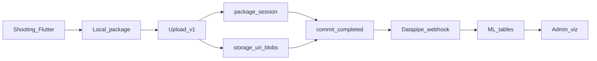

# Схема потока пакета

Статус: учебный артефакт блока «Архитектура». Источник правды: спеки `06`, `07`, `08`, `project-storage-uris`, обзор datapipe из E2E.

## Диаграмма



## Шаги

| # | Этап | Что происходит | Где смотреть |
| --- | --- | --- | --- |
| 1 | **Съёмка** | Оператор проходит `config.flow.steps` в Flutter; черновик в Riverpod + Drift | Мобилка: сценарий, история |
| 2 | **Materialize** | Submit → каталог `packages/<id>/payload.json` + `blobs/` | Локальный диск устройства |
| 3 | **Upload** | Вкладка «Сервер»: POST session → PUT blobs → PUT manifest → POST commit | `/v1/projects/{id}/packages…`, `serverDeliveryState` |
| 4 | **Storage** | Метаданные в project DB; файлы в fsspec по `storage_uri` | `package_session`, `uploaded_blob`, `packages/{id}/blobs/…` |
| 5 | **Datapipe** | После `completed` — webhook / стадия 0 (CVAT, первичный инференс) | `collector/pipeline.json`, логи datapipe |
| 6 | **Визуализация** | Слои из project DB + `collector/viz.json` в админке `/ui/packages/` | Workspace → Визуализация |

## Протокол upload (деталь)

```text
POST  /v1/projects/{project_id}/packages          → awaiting_blobs
PUT   .../packages/{package_id}/blobs/{path}      → uploaded_blob
PUT   .../packages/{package_id}/manifest          → ready_to_commit  (или 422 missing_blobs)
POST  .../packages/{package_id}/commit            → completed
```

Фазы `package_session.phase`: `awaiting_blobs` → `ready_to_commit` → `completed` | `failed`.

## Статусы на клиенте

| Поле Drift | Значения | Смысл |
| --- | --- | --- |
| `status` | `draft` / `completed` | Локальный сбор |
| `serverDeliveryState` | `pending` / `uploading` / `completed` / `failed` | Доставка на сервер |

Отправка **не** стартует автоматически после submit — только с вкладки «Сервер».

## Связанные документы

- [data-models-reference.ru.md](data-models-reference.ru.md) — payload и таблицы
- [diagnostics-checklist.ru.md](diagnostics-checklist.ru.md) — точки диагностики
- [korovas-broken/cases.md](korovas-broken/cases.md) — учебные сбои на этом потоке
- Спеки: [`specs/06-upload-lifecycle.ru.md`](../../specs/06-upload-lifecycle.ru.md), [`specs/08-server-api-package-upload.ru.md`](../../specs/08-server-api-package-upload.ru.md)
