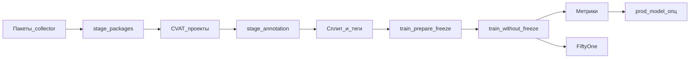
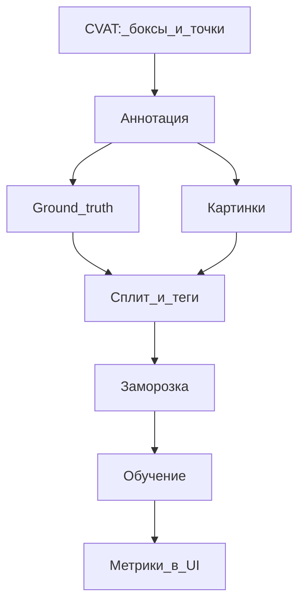
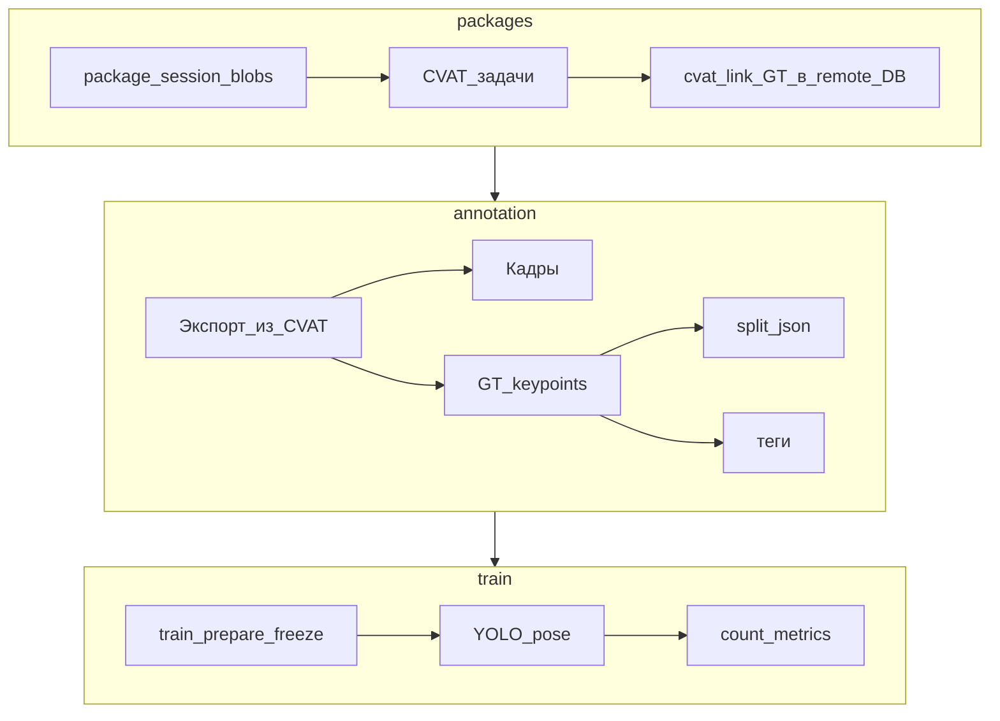

# Схема потока: ключевые точки коров

Статус: учебный артефакт блока Datapipe. Источник правды: `experiments/key_points_regression_datapipe` (readme, `app.py`, `ops_specs.py`).

## Полный контур

## Путь walkthrough (разметка уже есть)

На демо часто стартуют не с пустых пакетов, а с готовых проектов CVAT:

## Стадии подробно

## Где что смотреть

| Этап | Что получается | Где смотреть |
| --- | --- | --- |
| packages | Задачи в CVAT, ссылки в project DB | CVAT, Datapipe Runs, таблицы `cvat_link` |
| annotation | Кадры + GT + split + tags | Datapipe UI → Image / Runs |
| train-prepare | Frozen dataset | Frozen Datasets |
| train-without-freeze | Модель + метрики | Training, Metrics, логи Runs |
| fiftyone | Датасет для просмотра | FiftyOne App (если поднят) |

## Картинки: откуда берутся

Кадры могут лежать в разных местах; пайплайн подтягивает их по настройке проекта:

| Источник | Когда типично |
| --- | --- |
| S3 / MinIO | Пакеты collector, старые проекты с `image_source: s3` |
| CVAT | Кадры уже в задаче разметки |
| Локальный диск | Учебный стенд / копия для отладки |

Не фиксируйте в презентациях «сколько картинок на стенде» как продакшен-цифру: локальный demo и боевые датасеты различаются.

## Ground truth

В рабочем контуре эталон часто уже лежит в CVAT (размеченные кадры). Стадия аннотации забирает готовое. Отдельный «merge разметки» в продакшен-истории walkthrough не нужен: на слайдах достаточно названия **Ground truth**.

## Сплит и теги

| Понятие | Смысл |
| --- | --- |
| **Сплит** | Деление на train / val / test (`split.json`, ключи = имена CVAT-проектов) |
| **Теги** | Метка группы кадров (часто = имя CVAT-проекта) → метрики по группам |

## Связанные документы

- [stages-reference.ru.md](stages-reference.ru.md)
- [cow-keypoints-walkthrough.ru.md](cow-keypoints-walkthrough.ru.md)
- [diagnostics-keypoints.ru.md](diagnostics-keypoints.ru.md)
- Architecture package flow: [`../architecture/package-flow.md`](../architecture/package-flow.md)
