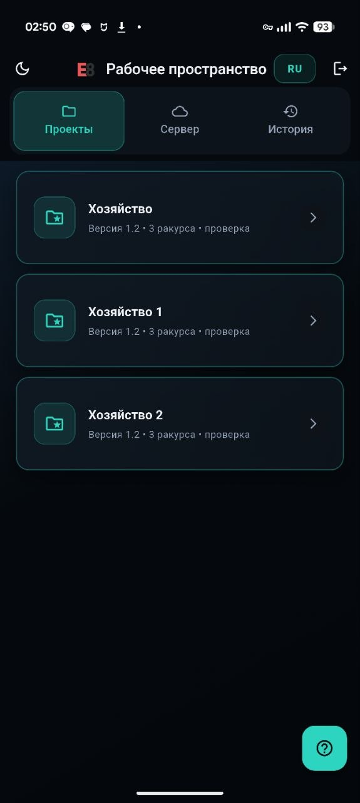
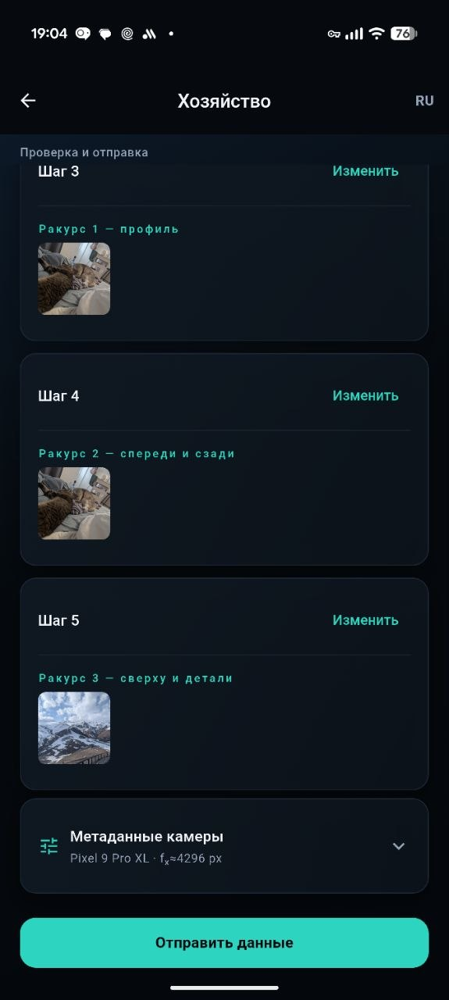
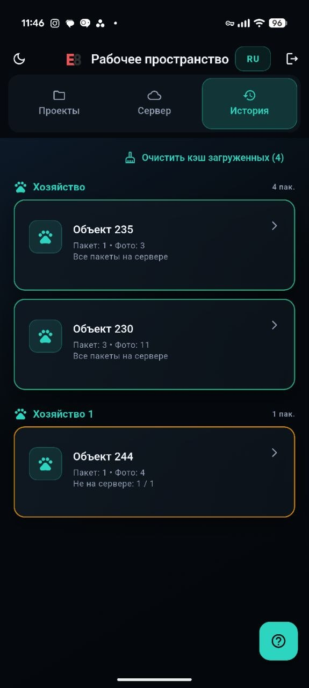
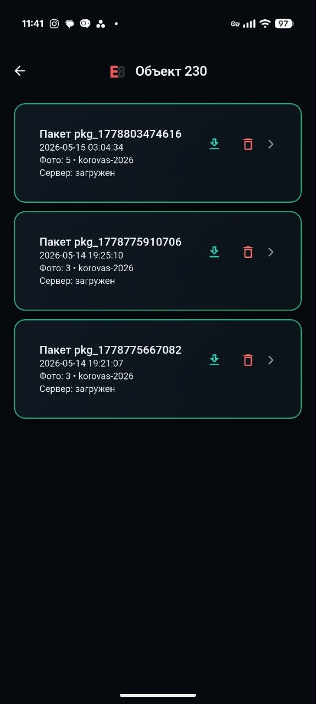
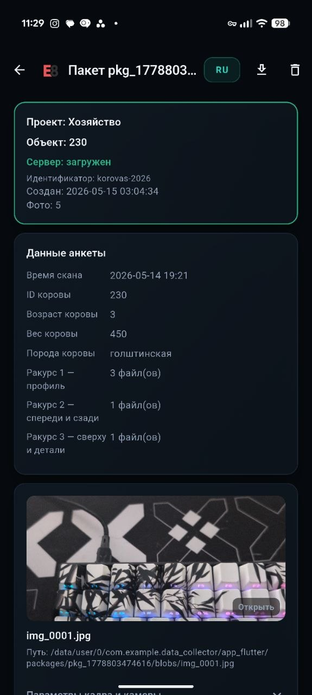

# Руководство пользователя: мобильное приложение

> **Это пример** пользовательского пути на конкретном проекте — сбор данных по КРС
> (проект «Хозяйство» / `korovas`). Он показывает **общий поток фреймворка** data_collector:
> вход → выбор проекта → заполнение формы по конфигу → отправка пакета на сервер.
> В вашем проекте поля и шаги будут другими — они задаются конфигом в админке
> (см. [руководство по админ-панели](../admin-panel/README.md)), но логика работы та же.

## **1. Вход в приложение**

Укажите учётные данные:

- **Логин:** `kcow@epoch8.com`
- **Пароль:** `kcow@123`

.jpg)

---

## **2. Выбор проекта**

1. Откройте вкладку **Project** (Проект).
2. Выберите проект Хозяйство.

**Важно:** настройка доступа  и кастомизация шагов проектов задаются администратором в административной панели. Подробнее в гайде по админ панели.

Ожидаемая модель: **отдельный проект на каждое хозяйство**. Проекты могут совпадать по структуре, но различаться по названию (имени хозяйства).

---

## **3. Заполнение полей проекта**

Заполните поля выбранного проекта в соответствии с требованиями  сценария сбора данных.

### Шаг 1. Общее параметры

### Шаг 2. Общая инструкция по съемке

### Шаги 3-5.  Инструкция с примерами и окно для отправки фотографий (несколько ракурсов) с последовательной сменой ракурса

### Шаг 6.  Форма проверки результата с возможностью корректировки

## **4. Загрузка данных на сервер**

Изначально собранные пакеты сохраняются локально на телефоне, после сбора данных нужно отправить пакеты на сервер для дальнейшей обработки

1. Перейдите на вкладку **Сервер**.
2. Нажмите кнопку **Загрузить** (иконка “облако со стрелкой”), чтобы отправить данные на сервер.

---

## **5. Дополнительные возможности**

| **Возможность** | **Описание** |
| --- | --- |
| **История загрузки пакетов** | Доступен **просмотр истории** и **текущего статуса** пакета (отправка, доставка, ошибки и т. п.  уточните формулировки под ваши статусы в UI). |
| **Тема оформления** | Переключение между светлой и тёмной темой. |
| **Язык интерфейса** | Переключение языка; подписи и элементы интерфейса отображаются на выбранном языке. Сейчас доступны русский и английский; при необходимости можно добавить другие языки. |
| **Справка** | Кнопка справки открывает краткое руководство по использованию приложения. |
| **Сессия** | При повторном открытии приложения сессия **восстанавливается автоматически** (где это поддерживается логикой приложения). |
| **Пред заполнение полей из локальной истории** | Если на телефоне ранее уже заполняли данные по корове они автоматически подтянутся из локальной базы |
| **Проверка качества кадра** | Проверка кадра на размытие и затеменение/засветы |
- **История загрузки пакетов**
    
    Каждая корова группируется в свой пак, историю данных собранных по корове можно посмотреть отдельно
    
    
    
    История данных разбитая по коровам и хозяйствам
    
    
    
    Пакеты собранные по каждой конкретной корове
    
    
    
    Просмотр содержимого пакета с возможностью выгрузки
    
- **Тема оформления**
    
    .jpg)
    
    Доступны светлая и темная тема для удобства использования приложения в различных условиях освещенности
    
- **Язык интерфейса**
    
    .jpg)
    
    .jpg)
    
- **Справка**
    
    .jpg)
    
    Форма справка открывается при нажатии на иконку знака вопроса на главном экране приложения
    
- **Восстановление сессии**
    
    
    
- **Пред заполнение полей из локальной истории**
    
    
    
- **Проверка качества кадра**
    
    