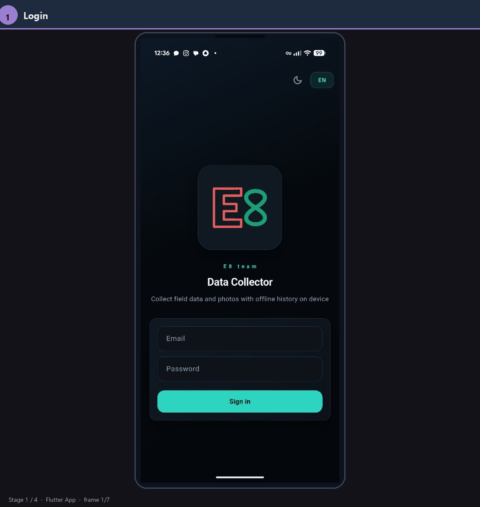

> **Language / Язык:** **English** · [Русский](README.ru.md)

# User guide: mobile app

Operator workflow in the data_collector mobile client: sign-in → project selection → filling the form per config → sending a package to the server. Fields and steps depend on the project config set in the [admin panel](../admin-panel/README.md).

Screenshots below are from the product presentation ([`specs/presentation/img/Flutter_en/`](../../specs/presentation/img/Flutter_en/)), assembled as an animated walkthrough.

## **Main workflow**

Sign in → configs from server → fill the form (multiple steps) → project cache and upload.

### **1. Signing in**

Sign in with the Firebase account issued by your administrator (email and password).

### **2. Selecting a project**

1. Open the **Project** tab.
2. Select the project you have access to.

**Important:** which projects are visible and how the collection form is structured are configured in the admin panel. See the admin panel guide for details.

### **3. Filling in project fields**

Fill in the fields according to the collection scenario defined in the project config: parameters, instructions, media capture steps, and a review screen before submit.

### **4. Uploading data to the server**

Collected packages are saved locally on the device first (offline-first). When ready, send them to the server for processing.

1. Go to the **Server** tab.
2. Tap **Upload** (cloud-with-arrow icon) to send queued packages.

---

## **5. Additional features**

| **Feature** | **Description** |
| --- | --- |
| **Package upload history** | View history and current status of uploads (sending, delivery, errors, etc.). |
| **Theme** | Switch between light and dark theme. |
| **Interface language** | Switch UI language; Russian and English are available; more languages can be added if needed. |
| **Help** | The help button (question mark on the home screen) opens a brief in-app guide. |
| **Session** | When reopening the app, the session is restored automatically where supported. |
| **Pre-fill from local history** | Previously entered values on this device can be pulled from the local database. |
| **Frame quality check** | Checks frames for blur and under/over-exposure before capture. |
