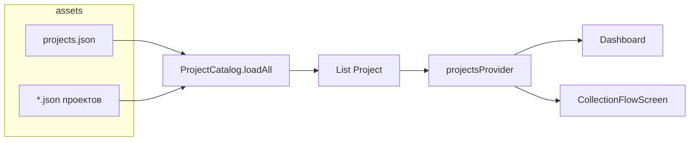
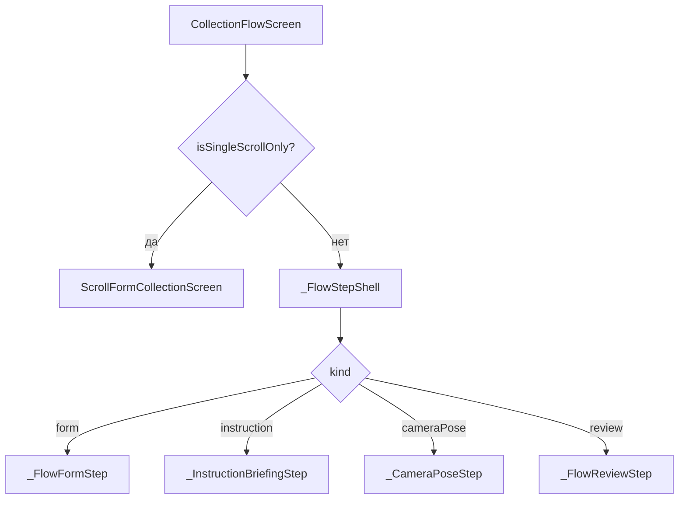
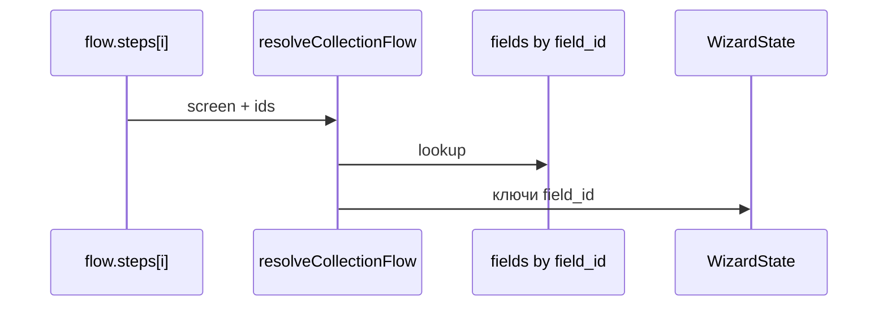

# JSON → экран сбора (как в коде)

Пайплайн от файлов в `assets/config/` до Flutter-виджетов. **Как писать JSON** — [09-project-json-builder-guide.md](09-project-json-builder-guide.md). Модель данных (часть устарела) — [../02-data-models-schema.md](../02-data-models-schema.md). Экраны — [../03-user-journey-screens.md](../03-user-journey-screens.md).

Схема: [json-ui-flow.drawio](json-ui-flow.drawio). Старый поток Korovas + пакет: [../korovas/v0_shema.drawio](../korovas/v0_shema.drawio).

---

## 1. Откуда проект

| Шаг | Где | Действие |
|-----|-----|----------|
| 1 | `assets/config/projects.json` | Массив `projects` — пути к JSON. |
| 2 | `project_catalog.dart` | Читает манифест, `rootBundle.loadString`, `Project.fromJson`. |
| 3 | `pubspec.yaml` | `flutter.assets` включает `assets/config/`. |
| 4 | `project_providers.dart` | `projectsProvider` → UI. |

`id` проекта должен быть **уникален** во всех файлах манифеста; иначе `firstWhere` по `projectId` возьмёт первый попавшийся.

---

## 2. Корень файла проекта

Модель: `lib/models/project_config.dart` → `Project`.

| JSON | Назначение |
|------|------------|
| `id`, `name`, `version` | Роутинг, БД, заголовки. |
| `config.fields` | Справочник полей. |
| `config.flow.steps` | Сценарий экранов. |
| `config.ui` | Опционально: строки для `ProjectUi`. |

В **пошаговом** режиме поля на шаге `form` только из **`field_ids`**. В **одном шаге `scroll_form`** на экран попадают **все** `config.fields` по `priority` (см. §4.1).

---

## 3. Резолвер

`collection_flow_resolver.dart` — **`resolveCollectionFlow(Project)`**: обход `flow.steps` по порядку → `ResolvedCollectionStep` с `kind`.

### 3.1. `screen` → вид

| `screen` | `kind` | Поля шага |
|----------|--------|-----------|
| `scroll_form` | scrollForm | `field_ids` в резолвере не ограничивают **ScrollFormCollectionScreen**: экран берёт **все** `config.fields` по `priority`. |
| `form` | form | Обязательны **`field_ids`**; только `text_input` и `datetime`. Опционально `cow_id_hints`, `cow_id_field_id`. |
| `instruction` | instruction | **`field_id`** → тип `instruction`. |
| `camera_pose` | cameraPose | **`field_id`** → тип `camera_photo`. |
| `review` | review | Только `id`. |

Несовместимый `screen`/тип → **`FormatException`**.

Алиасы парсера: `scrollform`, `cameraphoto`; регистр и дефисы нормализуются.

### 3.2. Один скролл vs мастер

Один шаг и он `scroll_form` → **`isSingleScrollOnly`** → сразу `ScrollFormCollectionScreen`.

Если шагов **> 1**, среди них **не должно** быть `scroll_form` — иначе исключение при резолве.

### 3.3. Камера: индекс позы

По порядку шагов `camera_pose` считаются `poseIndex1Based` (1…N среди камер) и `poseTotal` — для ленты и `camera_capture_context`.

### 3.4. `review`

Есть `camera_pose`, но нет шага `review` → резолвер **добавляет** `review` в конец.

---

## 4. Две ветки UI

Вход: **`CollectionFlowScreen(projectId)`** (`collection_flow_screen.dart`).

### 4.1. Scroll

Файл: `scroll_form_screen.dart`. Данные: **`project.config.fields`**, сортировка **`priority`**. Ограничить набор полей без правки кода нельзя — убрать лишнее из `fields` или перейти на пошаговый `form`.

### 4.2. Мастер

`_step` → `resolvedFlow.steps[_step]`; `_buildStep` — `switch` по `kind`. Лента и подписи частично из **`ProjectUi`** → `config.ui`.

---

## 5. Данные по шагам (мастер)

- **`form`**: значения в `wizardState` по **`field_id`**.
- **`camera_pose`**: пути под **`field_id`** поля `camera_photo`; плюс **`camera_capture_context`** (см. `PackagePayloadKeys`).

---

## 6. `config.ui` и `ProjectUi`

`project_ui.dart`: **`ProjectUi(project)`** читает **`project.config.ui`**.

- `str(['flow', 'ribbon', 'form'], fallback)` — вложенные ключи.
- `tpl(..., {'count': ...})` — подстановки в строке.
- `strings`, `listAt` — списки.

`ShootingGuideBody` — ветка **`ui.shooting_guide`**, в т.ч. **`pose_cards`**.

---

## 7. Пример `korovas-2026.json`

`form` → `instruction` → три `camera_pose` → `review`. Группировка истории по «субъекту» — если включено в резолвере (`shouldGroupHistoryBySubject`).

---

## 8. Поле есть в JSON, в UI нет

1. Дублирующийся **`id`** у другого файла.  
2. Нет пути в **`projects.json`**.  
3. Нет записи в **`config.fields`** с нужным **`field_id`**.  
4. **Scroll**: порядок — `priority`; `field_ids` у шага не фильтруют экран.  
5. **Мастер**: для `form` — поле в **`field_ids`**; для `instruction` / `camera_pose` — **`field_id`**.  
6. После правок **assets** — полный **restart** (hot reload не гарантирует).

---

## 9. Файлы кода

| Тема | Файл |
|------|------|
| Загрузка проектов | `lib/features/projects/project_catalog.dart` |
| Модели | `lib/models/project_config.dart` |
| Резолв шагов | `lib/features/collection/logic/collection_flow_resolver.dart` |
| Вход scroll/wizard | `lib/features/collection/presentation/flow/collection_flow_screen.dart` |
| Скролл | `.../scroll_form_screen.dart` |
| Состояние мастера | `.../providers/wizard_state_provider.dart` |
| Тексты UI | `.../flow/project_ui.dart` |
| Гайд по съёмке | `.../flow/shooting_guide.dart` |

Меняете резолвер или `CollectionFlowScreen` — обновите этот файл и гайд `09` в том же изменении.
