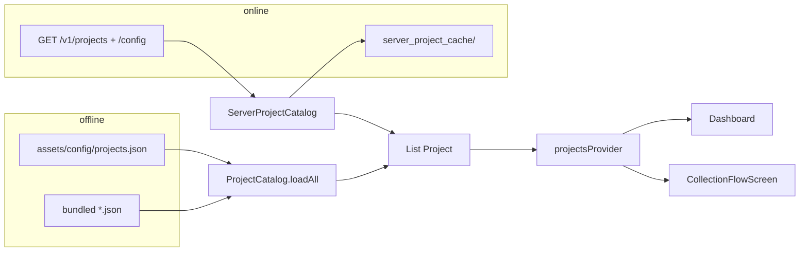

# JSON → экран сбора (как в коде)

Статус: **актуально** (июнь 2026).

Пайплайн от JSON до Flutter-виджетов. **Как писать JSON** — [09-project-json-builder-guide.md](09-project-json-builder-guide.md). Модель данных — [../02-data-models-schema.md](../02-data-models-schema.md). Экраны — [../03-user-journey-screens.md](../03-user-journey-screens.md).

Схема: [json-ui-flow.drawio](json-ui-flow.drawio).

---

## 1. Откуда проект

| Режим | Условие | Источник |
|-------|---------|----------|
| Офлайн | `API_BASE_URL` не задан | `project_catalog.dart` → `rootBundle` |
| Онлайн | `ApiEnvironment.isConfigured` | `server_project_catalog.dart` → Dio + ETag cache |

`projectsProvider` (`lib/features/projects/providers/project_providers.dart`) ждёт Firebase session перед `/v1/projects`.

`id` проекта должен быть **уникален**; иначе `firstWhere` по `projectId` возьмёт первый попавшийся.

---

## 2. Корень файла проекта

Модель: `lib/models/project_config.dart` → `Project`.

| JSON | Назначение |
|------|------------|
| `id`, `name`, `version` | Роутинг, заголовки, manifest |
| `config.fields` | Справочник полей |
| `config.flow.steps` | Сценарий: только `scroll_form` и `review` |
| `config.ui` | Опционально: `ProjectUi` |

---

## 3. Резолвер

`collection_flow_resolver.dart` — **`resolveCollectionFlow(Project)`**:

- Поддерживаются **только** `screen: scroll_form` и `screen: review`.
- Legacy `form` / `instruction` / `camera_pose` → **`FormatException`**.
- Каждое поле из `fields` должно быть в **ровно одном** `scroll_form.field_ids`.

### 3.1. `scroll_form`

| Свойство | Поведение |
|----------|-----------|
| `field_ids` | Обязателен, непустой; порядок = порядок на экране |
| `form_title` | Подпись блока на review |
| `cow_id_hints`, `cow_id_field_id` | Подсказки идентификатора субъекта |

Поля на шаге могут быть любых поддерживаемых типов (`text_input`, `datetime`, `instruction`, `camera_photo`) в одном скролле.

### 3.2. `review`

Только `id`; показывает сводку перед submit.

### 3.3. Один vs несколько шагов

- Один шаг и он `scroll_form` → **`isSingleScrollOnly`** → сразу `ScrollFormCollectionScreen`.
- Несколько шагов → `CollectionFlowScreen` + `_FlowStepShell` по порядку `flow.steps`.

### 3.4. Камера

Глобальный номер ракурса (`poseIndex1Based`) считается по порядку полей `camera_photo` во всех `scroll_form` шагах.

---

## 4. UI-ветки

Файлы:

- `scroll_form_screen.dart` — один скролл с полями шага.
- `collection_flow_screen.dart` — оболочка мастера.
- `scroll_form_flow_step.dart` — виджет шага в мастере.

---

## 5. Данные по шагам

- Значения в `wizardState` по **`field_id`**.
- `camera_photo`: map path → metadata; плюс **`camera_capture_context`** до materialize.
- Submit → `materializeLocalPackage` → относительные `blobs/...`, `camera_session` / `frame_camera`.

---

## 6. `config.ui` и `ProjectUi`

`project_ui.dart`: вложенные ключи, шаблоны `tpl`, `strings`, `listAt`.

Блок **`ui.shooting_guide`** в текущей версии клиента **не используется** (см. гайд `09`).

---

## 7. Медиа в инструкциях

Пути в Markdown (`instruction`) → файлы в **`collector/media/`** Git-репо.

Клиент: `GET /v1/projects/{id}/assets/{path}`; кэш `project_asset_paths.dart`.

Загрузка медиа — страница «Файлы» проекта в админке (`/ui/projects/{id}/media/`).

---

## 8. Поле есть в JSON, в UI нет

1. Дублирующийся **`id`** у другого файла.
2. Проект не в каталоге / не синкнулся с сервера.
3. Поле не в **`field_ids`** ни одного `scroll_form`.
4. Поле не в **`config.fields`**.
5. После правок assets — **full restart**; после правок Git-конфига — pull / перезапуск приложения.

---

## 9. Файлы кода

| Тема | Файл |
|------|------|
| Offline catalog | `lib/features/projects/project_catalog.dart` |
| Server catalog | `lib/features/projects/server_project_catalog.dart` |
| Providers | `lib/features/projects/providers/project_providers.dart` |
| Модели | `lib/models/project_config.dart` |
| Резолв | `lib/features/collection/logic/collection_flow_resolver.dart` |
| Вход | `lib/features/collection/presentation/flow/collection_flow_screen.dart` |
| Скролл | `lib/features/collection/presentation/flow/scroll_form_screen.dart` |
| Состояние | `.../providers/wizard_state_provider.dart` |
| Тексты UI | `.../flow/project_ui.dart` |
| Валидация на сервере | `django_server/api/project_config_validate.py` |

Меняете резолвер — обновите этот файл и [09-project-json-builder-guide.md](09-project-json-builder-guide.md).
