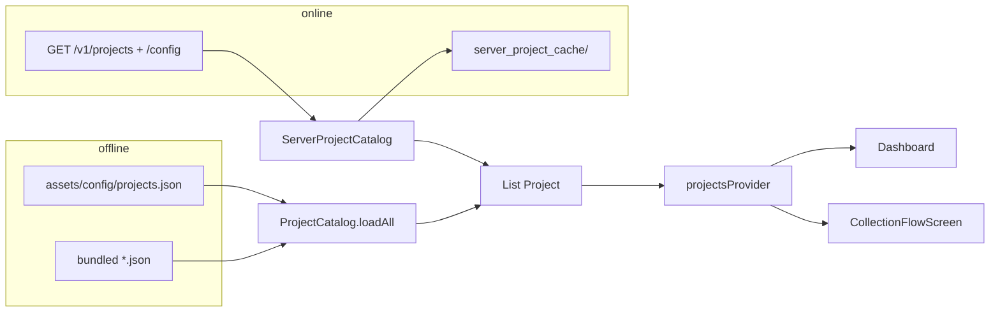
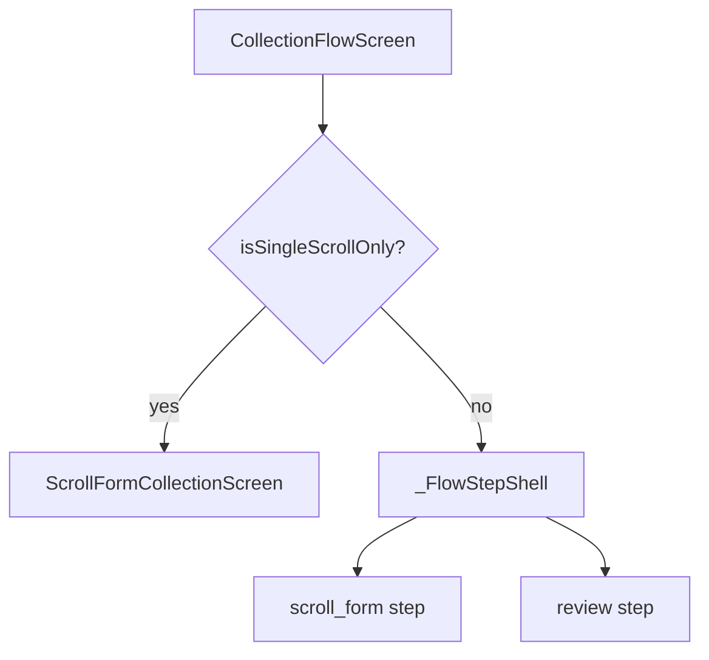

> **Language / Язык:** **English** · [Русский](json-driven-collection-ui.ru.md)

# JSON → collection screen (as in code)

Status: **current** (June 2026).

Pipeline from JSON to Flutter widgets. **How to write JSON** — [09-project-json-builder-guide.md](09-project-json-builder-guide.md). Data model — [../02-data-models-schema.md](../02-data-models-schema.md). Screens — [../03-user-journey-screens.md](../03-user-journey-screens.md).

Diagram: [json-ui-flow.drawio](json-ui-flow.drawio).

---

## 1. Where the project comes from

| Mode | Condition | Source |
|------|-----------|--------|
| Offline | `API_BASE_URL` not set | `project_catalog.dart` → `rootBundle` |
| Online | `ApiEnvironment.isConfigured` | `server_project_catalog.dart` → Dio + ETag cache |

`projectsProvider` (`lib/features/projects/providers/project_providers.dart`) waits for Firebase session before `/v1/projects`.

Project `id` must be **unique**; otherwise `firstWhere` by `projectId` picks the first match.

---

## 2. Project file root

Model: `lib/models/project_config.dart` → `Project`.

| JSON | Purpose |
|------|---------|
| `id`, `name`, `version` | Routing, titles, manifest |
| `config.fields` | Field catalog |
| `config.flow.steps` | Scenario: only `scroll_form` and `review` |
| `config.ui` | Optional: `ProjectUi` |

---

## 3. Resolver

`collection_flow_resolver.dart` — **`resolveCollectionFlow(Project)`**:

- Only `screen: scroll_form` and `screen: review` supported.
- Legacy `form` / `instruction` / `camera_pose` → **`FormatException`**.
- Every field from `fields` must be in **exactly one** `scroll_form.field_ids`.

### 3.1. `scroll_form`

| Property | Behavior |
|----------|----------|
| `field_ids` | Required, non-empty; order = on-screen order |
| `form_title` | Block label on review |
| `cow_id_hints`, `cow_id_field_id` | Subject identifier hints |

Fields on a step may be any supported type (`text_input`, `single_choice`, `datetime`, `instruction`, `camera_photo`) in one scroll.

### 3.2. `review`

Only `id`; shows summary before submit.

### 3.3. Single vs multiple steps

- One step and it is `scroll_form` → **`isSingleScrollOnly`** → directly `ScrollFormCollectionScreen`.
- Multiple steps → `CollectionFlowScreen` + `_FlowStepShell` in `flow.steps` order.

### 3.4. Camera

Global pose number (`poseIndex1Based`) counted by order of `camera_photo` fields across all `scroll_form` steps.

---

## 4. UI branches

Files:

- `scroll_form_screen.dart` — one scroll with step fields.
- `collection_flow_screen.dart` — wizard shell.
- `scroll_form_flow_step.dart` — step widget in wizard.

---

## 5. Data per step

- Values in `wizardState` by **`field_id`**.
- `camera_photo`: map path → metadata; plus **`camera_capture_context`** until materialize.
- Submit → `materializeLocalPackage` → relative `blobs/...`, `camera_session` / `frame_camera`.

---

## 6. `config.ui` and `ProjectUi`

`project_ui.dart`: nested keys, `tpl` templates, `strings`, `listAt`.

Block **`ui.shooting_guide`** is **not used** in current client version (see guide `09`).

---

## 7. Media in instructions

Paths in Markdown (`instruction`) → files in **`collector/media/`** Git repo.

Client: `GET /v1/projects/{id}/assets/{path}`; cache `project_asset_paths.dart`.

Media upload — project "Files" page in admin (`/ui/projects/{id}/media/`).

---

## 8. Field in JSON but not in UI

1. Duplicate **`id`** in another file.
2. Project not in catalog / not synced from server.
3. Field not in **`field_ids`** of any `scroll_form`.
4. Field not in **`config.fields`**.
5. After asset edits — **full restart**; after Git config edits — pull / app restart.

---

## 9. Code files

| Topic | File |
|-------|------|
| Offline catalog | `lib/features/projects/project_catalog.dart` |
| Server catalog | `lib/features/projects/server_project_catalog.dart` |
| Providers | `lib/features/projects/providers/project_providers.dart` |
| Models | `lib/models/project_config.dart` |
| Resolve | `lib/features/collection/logic/collection_flow_resolver.dart` |
| Entry | `lib/features/collection/presentation/flow/collection_flow_screen.dart` |
| Scroll | `lib/features/collection/presentation/flow/scroll_form_screen.dart` |
| State | `.../providers/wizard_state_provider.dart` |
| UI strings | `.../flow/project_ui.dart` |
| Server validation | `django_server/api/project_config_validate.py` |

When changing the resolver — update this file and [09-project-json-builder-guide.md](09-project-json-builder-guide.md).
